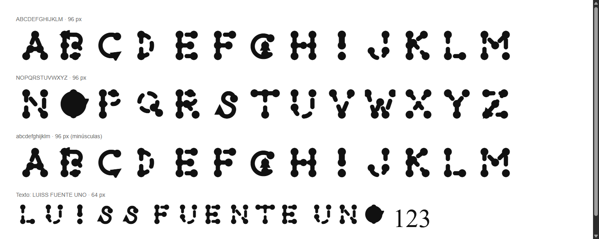
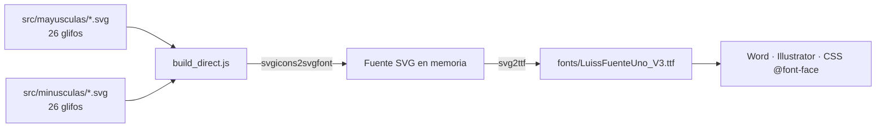

<div align="center">
  
  <h1>PrimeraFuente · LuissFuenteUno</h1>
  <p><b>Tipografía decorativa propia, construida a partir de 52 glifos SVG y compilada a una fuente .ttf instalable.</b></p>
  
  
  
  
  <p>
    <a href="#-inicio-rápido">Inicio rápido</a> ·
    <a href="#-características">Características</a> ·
    <a href="#-arquitectura">Arquitectura</a> ·
    <a href="#-pruebas">Pruebas</a> ·
    <a href="#-lo-que-todavía-no-existe">Limitaciones</a>
  </p>
</div>

**PrimeraFuente** es el repositorio de la fuente **LuissFuenteUno**: un tipo de letra decorativo de trazos con nodos circulares, pensado para títulos, iniciales y logotipos. Contiene los glifos SVG de origen, los scripts de Node.js que los compilan y el `.ttf` ya generado. **No** es una familia tipográfica completa: solo cubre las letras A-Z (y a-z) sin acentos, números ni signos.

## 🎬 Vista rápida

Muestra real generada cargando `fonts/LuissFuenteUno_V3.ttf` en Chrome (los números y el espacio de la última línea caen a la fuente por defecto porque la fuente no los incluye):



## ✨ Características

| Característica | Detalle |
|---|---|
| 52 glifos SVG | 26 en `src/mayusculas/` y 26 en `src/minusculas/`, nombrados `uXXXX-<letra>.svg` (código Unicode + carácter) |
| Fuente compilada | `fonts/LuissFuenteUno_V3.ttf` (≈15 KB) |
| Compilación reproducible | `build_direct.js` regenera exactamente el mismo `.ttf` (verificado: 14 888 bytes idénticos) |
| Minúsculas | Las 26 minúsculas usan **el mismo dibujo** que su mayúscula (los SVG son copias) |
| Guías de instalación | `docs/01` a `docs/04`: descargar, descomprimir, instalar (Windows/macOS) y usar en Word |

## 🏗️ Arquitectura



<details>
<summary>Estructura de carpetas y scripts</summary>

```text
build_direct.js   # compilación que SÍ funciona con el árbol actual (SVG -> TTF)
build_font.js     # intento con svgtofont; apunta a src/processed_svgs (ya no existe)
organize.js       # movió processed_svgs -> mayusculas/minusculas (histórico)
rename_svgs.js    # renombró A.svg -> u0041-A.svg (histórico)
src/mayusculas/   # u0041-A.svg ... u005A-Z.svg
src/minusculas/   # u0061-a.svg ... u007A-z.svg
fonts/            # LuissFuenteUno_V3.ttf
docs/             # guías 01-Descargar ... 04-Uso
```

</details>

## 🚀 Inicio rápido

**Solo usar la fuente**

1. Descarga `fonts/LuissFuenteUno_V3.ttf` desde GitHub (botón *Download raw file*).
2. Haz doble clic y pulsa **Instalar** (Windows) o **Instalar tipo de letra** (macOS).
3. Reinicia Word u otro editor y elige la fuente **LuissFuenteUno**; úsala en tamaños grandes (48 pt o más).

**Recompilarla**

| Requisito | Versión |
|---|---|
| Node.js | Verificado con v24.15 |
| Paquetes | `svgicons2svgfont` ^16 y `svg2ttf` ^6 |

```bash
npm install svgicons2svgfont svg2ttf   # evita instalar puppeteer, que no se usa en la compilación
node build_direct.js                   # escribe fonts/LuissFuenteUno_V3.ttf
```

> `npm install` a secas también funciona, pero descarga `puppeteer`, `potrace`, `fantasticon` y `svgtofont`, que ningún script útil actual necesita.

## 🧪 Pruebas

No hay pruebas automatizadas (`npm test` es el valor por defecto de `npm init` y falla a propósito). La verificación realizada fue manual: recompilar con `build_direct.js` produce un `.ttf` del mismo tamaño que el versionado y la muestra de arriba se renderiza en Chrome.

## 🚧 Lo que todavía no existe

- **Solo formato `.ttf`.** No hay `.woff`, `.woff2`, `.eot` ni CSS (existieron en commits antiguos y se eliminaron).
- **Sin números, signos, espacio ni acentos**: los caracteres no incluidos se muestran con otra fuente.
- **Minúsculas = mayúsculas**: no hay diseños propios en minúscula.
- **Legibilidad limitada**: es una fuente decorativa; algunas letras (p. ej. I, O, J) son muy abstractas.
- **`build_font.js`, `organize.js` y `rename_svgs.js` ya no funcionan** sobre el árbol actual: dependen de `src/processed_svgs/`, que se eliminó tras organizar.
- Las guías de `docs/` mencionan `LuissFuenteUno.ttf` y "LuissFuenteUnoBlueprint"; el archivo real se llama `LuissFuenteUno_V3.ttf` y la familia se registra como `LuissFuenteUno`.
- Los SVG originales con filtros/líneas punteadas y los `.woff/.woff2` que describía el README anterior **no están en el repositorio**.
- Sin pruebas automáticas ni CI.

## 📄 Licencia

Sin licencia definida: todos los derechos reservados por defecto.

<div align="center"><sub>Hecho por Luiss2080 · proyecto de Sistemas Multimedia</sub></div>
